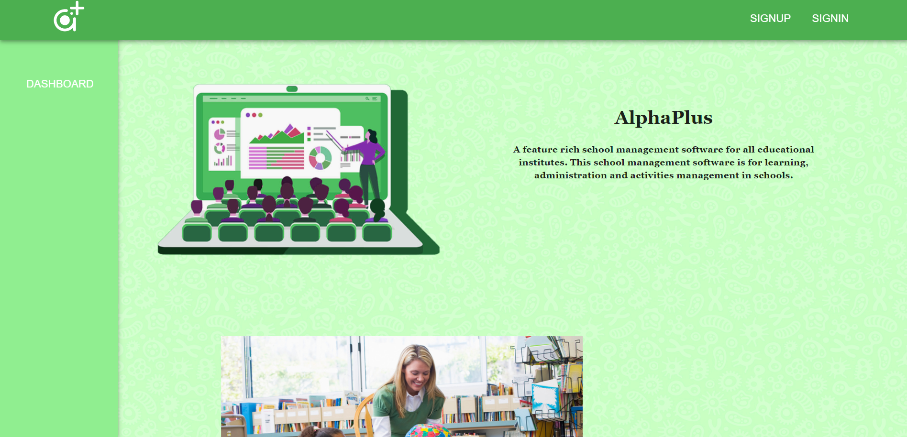

# AlphaPlus

    

## Description

Full-Stack Application using Django and sqlite3 for backend, React typeScript with Redux for frontend, Firebase Cloud Firestore for live chat between users. Users have different roles and functionalities, some of those include the ability of a user with "principal" role to create school and classes, assign teachers and students to classes, teachers can set up exams which students can take and their grades will be saved in the DB for parents to review using a Mobile app created using React Native.

## Install

1. Clone this repo
2. `npm i` to install dependancies
3. `npm start` to run the server
4. Open "localhost:3000" in your browser
5. Enjoy :\)

## Technologies

- [Django](https://www.djangoproject.com/) as the main backend app with the default [Sqlite](https://www.sqlite.org/index.html) local database.
- [React](https://reactjs.org/) as the main Front-end for the project.
- [React Router](https://reactrouter.com/) for managing the website directories.
- [Redux](https://redux.js.org/) for managing global state.
- [Typescript](https://www.typescriptlang.org/) to provide static typing properties during development.
- [Firebase](https://firebase.google.com/) used to provide live chat functionality for classrooms.
- [Stripe](https://stripe.com/) used to provide schools with an online payment option.
- [ML5](https://ml5js.org/) machine learning to monitor student grades and notify staff.

## Key Files

1. [Backend/core/settings.py](https://github.com/RamiOkkeh/OnlineSchoolSystem/blob/master/core/settings.py)

   - Manages installed Django apps.
   - Connects to the Sqlite database.
   - Serves the React Front-end template.

2. [Frontend/core/urls.py](https://github.com/RamiOkkeh/OnlineSchoolSystem/blob/master/core/urls.py)

   - Manages all paths for the backend api.

3. [Frontend/src/App.tsx]

   - Main react Component.
   - Handles the Routing for the Front-end side.

4. [Frontend/src/reducers/rootReducer.ts]

   - Creates Redux state and manages it.

5. [Frontend/src/ml5Training.js]

   - Was used to train a machine learning modle (development only)
   - Loads a pre-existing modle.

## Deployed Link: [AlphaPlus](https://oss-0.herokuapp.com/)
